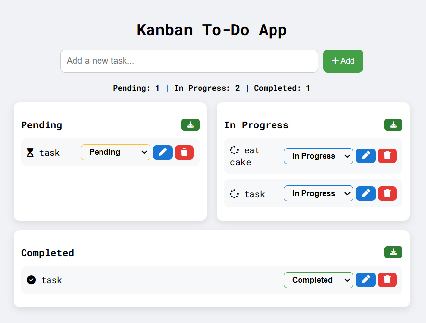

# Kanban To-Do APP

# About

- This is a mini Kanban-style To-Do App built using HTML, CSS, and JavaScript.

- It allows users to manage tasks visually through three statuses: Pending, In Progress, and Completed.

- Tasks are interactive, editable, and can be exported per status.

# Technologies Used

* HTML5 – Structure of the app
* CSS3 – Styling and layout, including Kanban columns
* JavaScript (ES6) - Interactivity, DOM manipulation, local storage
* Font Awesome – Icons for tasks
* Google Fonts (Roboto Mono) – Clean and readable font

# How to Run
* Clone or download the repository.  (git clone https://github.com/desireedagondon000-gif/to-do-app.git
* Open the folder in VS Code (or any code editor).
* Use Live Server (VS Code extension) to launch the app in your browser.
* Right-click todo.html and “Open with Live Server”
* Start adding tasks and managing their status!
